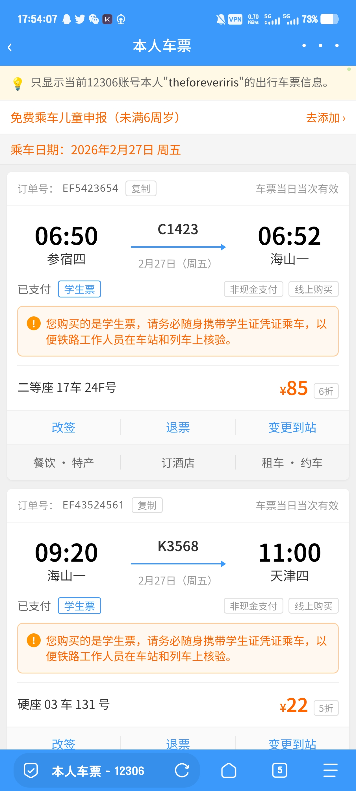
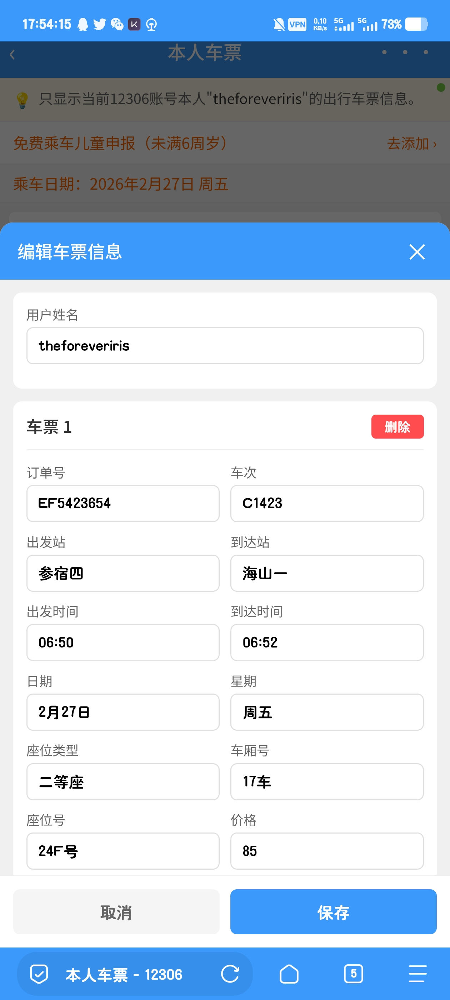

# 12306 本人车票页面 - 纯前端实现

一个vibe的 12306 App "本人车票" 页面的纯前端 HTML 实现，支持可视化编辑车票信息。



## 功能特点

### 1. 高度还原的 UI 设计
- **精确还原** 12306 官方 App 的界面布局和视觉风格
- **紧凑的排版**：时间、站点、车次信息清晰展示
- **学生票提示**：橙色圆角提示框，带感叹号图标
- **操作按钮**：改签、退票、变更到站功能入口
- **附加服务**：餐饮特产、订酒店、租车约车

### 2. 隐藏编辑模式
页面右上角有一个**极小的绿色圆点**（几乎不可见），点击后可进入编辑模式：



> 提示：绿点位于页面右上角，透明度仅 0.3，大小仅 4px， hover 时会放大显示

### 3. 可编辑内容
点击绿点进入编辑弹窗后，可以修改：

| 编辑项 | 说明 |
|--------|------|
| **用户姓名** | 修改页面顶部显示的用户名 |
| **订单信息** | 订单号、车次、出发/到达站 |
| **时间信息** | 出发时间、到达时间、日期、星期 |
| **座位信息** | 座位类型、车厢号、座位号 |
| **价格信息** | 票价、折扣（留空则不显示） |
| **票种切换** | 学生票/成人票切换 |
| **增删车票** | 添加新车票块或删除现有块 |

### 4. 智能显示逻辑
- **学生票**：勾选后显示橙色提示框，标签显示"学生票"
- **成人票**：不显示提示框，标签显示"成人票"
- **折扣为空**：价格旁不显示折扣标签
- **折扣有值**：显示如"6折"、"5折"等折扣标签

## 使用方法

### 直接打开
1. 将 HTML 文件保存为 `ticket.html`或使用我部署的GitHub page
2. 双击文件在浏览器中打开
3. 即可查看默认的车票信息

### 进入编辑模式
1. 将鼠标移动到页面**右上角**（"本人车票"标题右侧附近）
2. 寻找极小的**绿色圆点**
3. 点击绿点打开编辑弹窗
4. 修改需要编辑的字段
5. 点击"保存"应用更改

### 添加新车票
1. 进入编辑模式
2. 滚动到弹窗底部
3. 点击"**+ 添加新车票块**"按钮
4. 填写新车票信息
5. 保存后即可看到新的车票卡片

## 数据结构

每个车票块包含以下字段：

```javascript
{
    id: 1,
    orderNo: "EF5423654",
    trainNo: "C1423",
    fromStation: "参宿四",
    toStation: "海山一",
    startTime: "06:50",
    endTime: "06:52",
    date: "2月27日",
    week: "周五",
    isStudent: true,
    seatType: "二等座",
    carriage: "17车",
    seatNo: "24F号",
    price: "85",
    discount: "6折",
    payMethod: "非现金支付",
    buyMethod: "线上购买"
}

